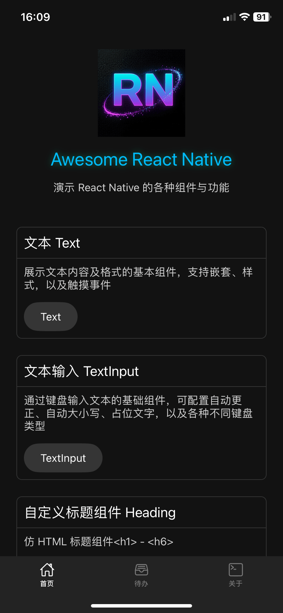
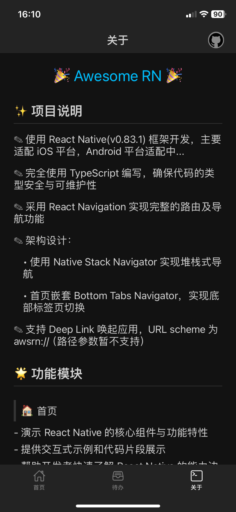
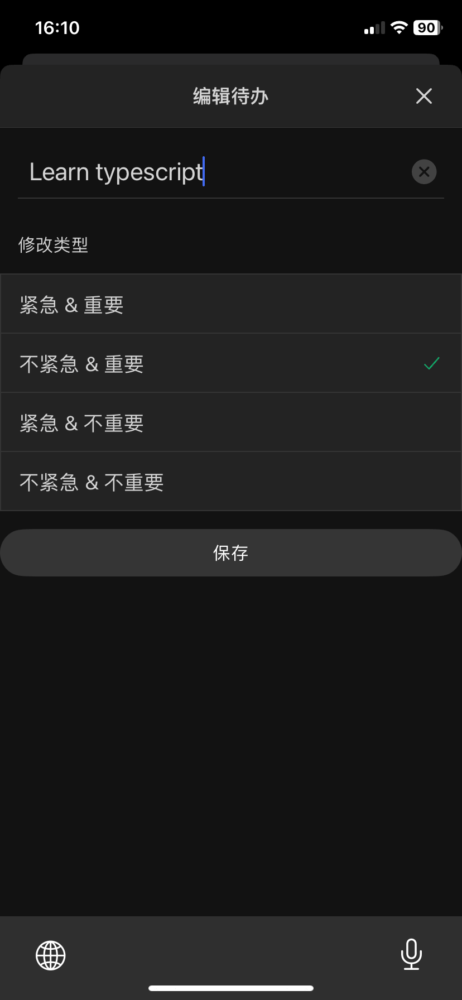
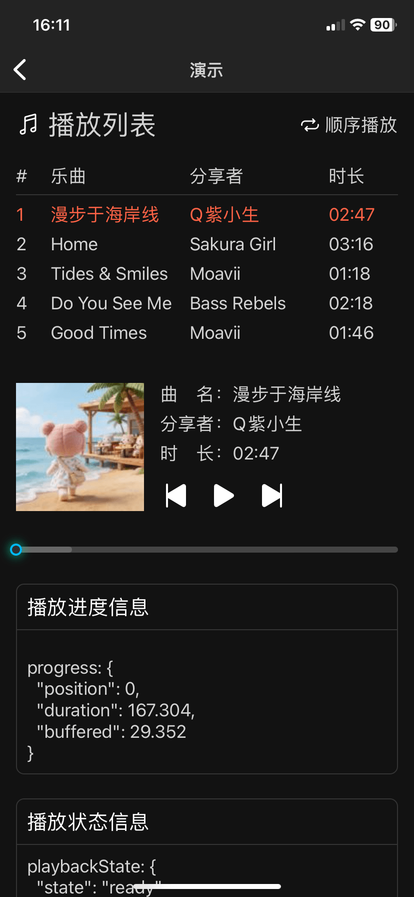
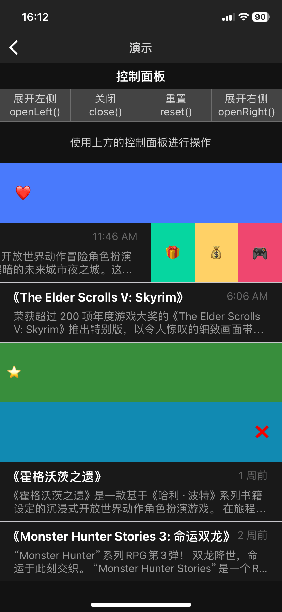
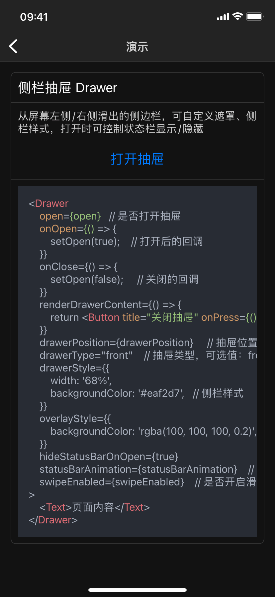

# 🎉 Awesome RN

<div align="center">
  
</div>

一个基于 React Native 打造的现代化移动应用示例项目，展示了一系列实用的功能组件和最佳实践。

## 👀 预览

### 滚动截屏（长图）

- [首页](snapshot/home.png)
- [关于](snapshot/about.png)

### 截屏

<div>
  
  
  
</div>

---

<div>
  
  
  
</div>

---

<div>
  
  
  
</div>

## ✨ 项目说明

- 📱 **技术栈**：使用 React Native (v0.83.1) 框架开发，主要适配 iOS 平台，Android 平台适配中...
- 🔒 **类型安全**：完全使用 TypeScript 编写，确保代码的类型安全与可维护性
- 🧭 **路由导航**：采用 React Navigation 实现完整的路由及导航功能
- 🏗️ **架构设计**：
  - 使用 Native Stack Navigator 实现堆栈式导航
  - 首页嵌套 Bottom Tabs Navigator，实现底部标签页切换
- 🔗 **Deep Link**：支持通过 `awsrn://` URL scheme 唤起应用（路径参数暂不支持）

## 🌟 功能模块

### 🏠 首页

- 演示 React Native 的核心组件与功能特性
- 提供交互式示例和代码片段展示
- 帮助开发者快速了解 React Native 的能力边界

### ✅ 待办事项管理

- 🚪 **抽屉导航**：使用 Drawer Navigator 实现右滑展开的抽屉式导航
- 📑 **标签切换**：通过 TabView 实现四个列表页面的流畅切换
- 💾 **状态管理**：
  - 使用 Zustand 进行全局状态与数据管理
  - 集成 Zustand immer 中间件，简化不可变数据更新操作
  - 采用 react-native-mmkv 实现高性能数据持久化存储
- 🎯 **交互功能**：
  - 支持左滑展开操作按钮（编辑、删除、恢复）
  - 完整的 CRUD 操作：添加、编辑、删除、恢复、清空
  - 四象限分类功能（紧急度 × 重要性矩阵）

### 🎵 音乐播放器

- 基于 react-native-track-player 实现专业级音频播放
- 支持歌单管理、后台播放等核心功能
- 进度条拖拽使用 react-native-gesture-handler 实现，优雅解决与导航返回手势的冲突

## 📦 技术选型

### 核心库

| 类别 | 库名 | 文档 |
|------|------|------|
| 路由导航 | React Navigation | [文档](https://reactnavigation.org/) |
| 手势处理 | React Native Gesture Handler | [文档](https://docs.swmansion.com/react-native-gesture-handler/) |
| 动画 | React Native Reanimated | [文档](https://docs.swmansion.com/react-native-reanimated/) |
| 状态管理 | Zustand | [文档](https://zustand.docs.pmnd.rs/) |
| 数据存储 | React Native MMKV | [GitHub](https://github.com/mrousavy/react-native-mmkv) |
| 音频播放 | React Native Track Player | [文档](https://doublesymmetry.github.io/react-native-track-player/) |
| UI 图标 | React Native Vector Icons | [GitHub](https://github.com/oblador/react-native-vector-icons) |
| 代码高亮 | React Native Syntax Highlighter | [GitHub](https://github.com/conorhastings/react-native-syntax-highlighter) |

## 🚀 快速开始

```bash
# 安装依赖
npm install

# iOS 运行
cd ios && pod install && cd ..
npm run ios

# Android 运行
npm run android
```

## ☕️ 源码地址

项目开源在 GitHub：[kiinlam/awesomer-nr](https://github.com/kiinlam/awesomer-nr)

欢迎 ⭐️ Star 支持，也期待 🐛 Issue 和 💡 PR 改进！